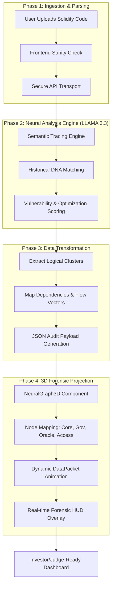

# System Architecture & Forensic Workflow

This document provides a visual and technical breakdown of how **DefiGuardian** processes smart contracts through our Neural Analysis Pipeline.

## 1. High-Level System Workflow
The following diagram illustrates the journey of a smart contract from upload to its 3D forensic projection.

## 2. Technical Component Breakdown

### A. Semantic Tracing Engine
Unlike traditional scanners that search for "bad strings," our engine performs a **Value-Flow Analysis**. It traces the lifecycle of assets (ETH/Tokens) through the contract's logic to see if state-changing operations can be triggered by unauthorized actors.

### B. Logical Cluster Mapping
The engine categorizes code blocks into roles:
- **Governance**: Voting and proposal logic.
- **Oracles**: External price and data dependencies.
- **Access Control**: Administrative and permission gates.

### C. 3D Neural Projection
The visuals in the interface are data-driven:
- **Line Thickness/Opacity**: Represents the complexity of the link.
- **Dashed Lines**: Represent Access Control (Admin) paths.
- **Data Packets**: Represent real-time "logical queries" performed by the AI during the forensic trace.

---
**Judge's Summary:**
*"The 3D Neural Interface acts as the 'Digital Twin' of the smart contract's security posture. Every dot, line, and pulse corresponds to a real logical connection verified by our LLAMA-powered Semantic Engine."*
